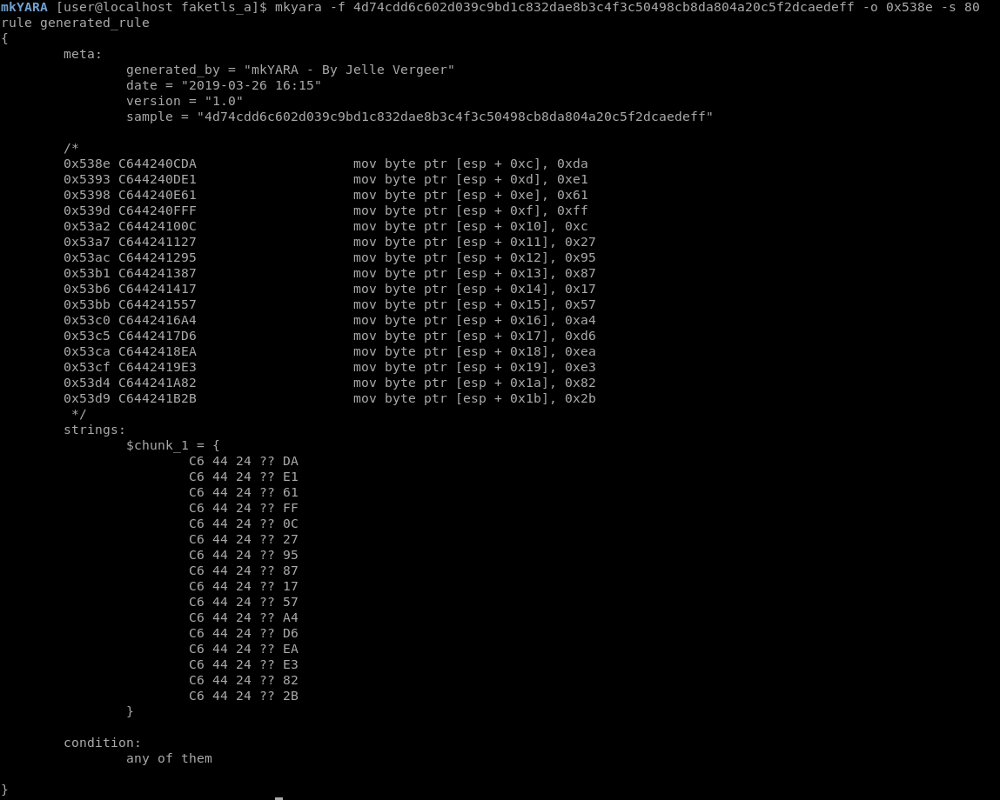
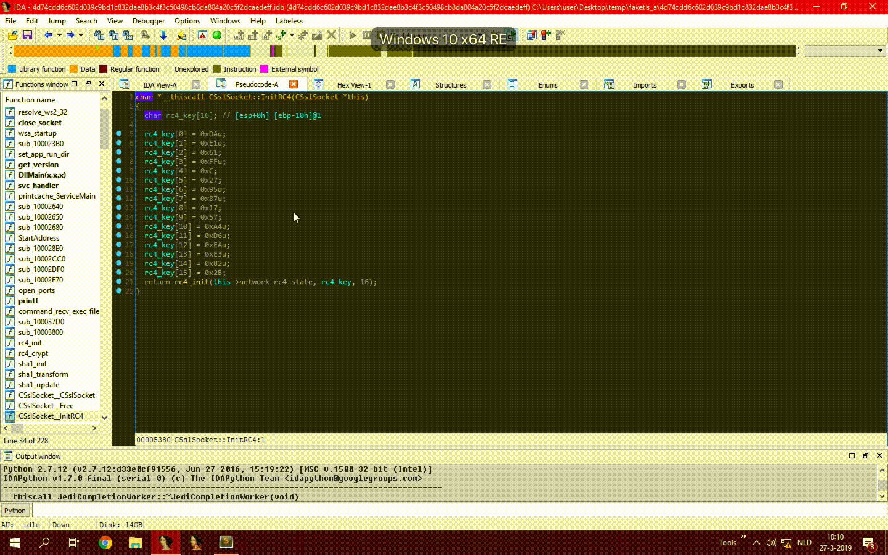

# mkYARA
Writing YARA rules based on executable code within malware can be a tedious task. An analyst cannot simply copy and paste raw executable code into a YARA rule, because this code contains variable values, such as memory addresses and offsets. The analyst has to disassemble the code and wildcard all the pieces in the code that can change between samples. mkYARA aims to automate this part of writing rules by generating executable code signatures that wildcard all these little pieces of executable code that are not static.

## Installation
Installation is as easy as installing the pip package.
``` 
pip install mkyara
```

## Usage
```python
import codecs
from capstone import CS_ARCH_X86, CS_MODE_32
from mkyara import YaraGenerator

gen = YaraGenerator("normal", CS_ARCH_X86, CS_MODE_32)
gen.add_chunk(b"\x90\x90\x90", offset=1000)
gen.add_chunk(codecs.decode("6830800000E896FEFFFFC3", "hex"), offset=0x100)
gen.add_chunk(b"\x90\x90\x90\xFF\xD7", is_data=True)
rule = gen.generate_rule()
rule_str = rule.get_rule_string()
print(rule_str)
```

## Standalone Tool
mkYARA comes with a standalone tool that is cross platform, as in, it can create signatures for Windows binaries running under Linux. 

```commandline
usage: mkyara [-h] [-i {x86}] [-a {32,64,x86,x64}] -f FILE_PATH [-n RULENAME]
              -o OFFSET -s SIZE [-m {loose,normal,strict}] [-r RESULT] [-v]

Generate a Yara rule based on disassembled code

optional arguments:
  -h, --help            show this help message and exit
  -i {x86}, --instruction_set {x86}
                        Instruction set
  -a {32,64,x86,x64}, --instruction_mode {32,64,x86,x64}
                        Instruction mode
  -f FILE_PATH, --file_path FILE_PATH
                        Sample file path
  -n RULENAME, --rulename RULENAME
                        Generated rule name
  -o OFFSET, --offset OFFSET
                        File offset for signature
  -s SIZE, --size SIZE  Size of desired signature
  -m {loose,normal,strict}, --mode {loose,normal,strict}
                        Wildcard mode for yara rule generation
                        loose = wildcard all operands
                        normal = wildcard only displacement operands
                        strict = wildcard only jmp/call addresses
  -r RESULT, --result RESULT
                        Output file
  -v, --verbose         Increase verbosity

```


## IDA Plugin
mkYARA comes with a IDA plugin to easily create YARA signatures by selecting a set of instructions and choosing one of the mkYARA -> Generate YARA rule options. Installation is as easy as installing the pip package and copying the mkyara_plugin.py to your IDA plugin directory.


